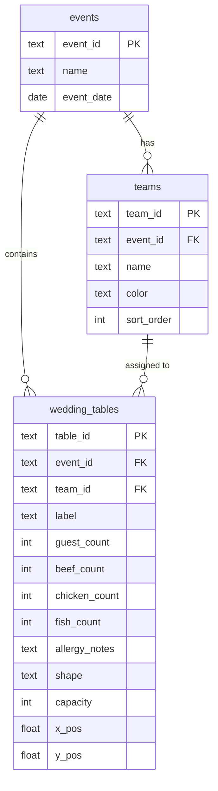

# Floor Plan Manager — Path to 100% Complete

## Current state (verified)
- `app.js` (869 lines) handles both views in one file: draggable tables, add/edit/delete modal, entrée counts, allergy pulse, service-pass queue, and TV realtime.
- Teams are **hardcoded** in three places: the `<select>` in [index.html](index.html), `TEAM_COLORS` + the `'Team 1'..'Team 4'` array in [app.js](app.js), and `.team-tab[data-team=...]` rules in [style.css](style.css).
- Only the TV view subscribes to realtime; the admin view does not.
- All tables share one global set (no event/wedding separation).
- RLS is disabled; the anon key has full read/write.

## Target data model

Key change: tables reference a team via **`team_id`** (not the free-text `server_team`). Team name + color come from the `teams` table, so colors stop being hardcoded.

## Phase 1 — Database schema & migration (Supabase SQL)
Create a versioned `db/migrations.sql` in the repo (for reference) and run it in the Supabase SQL editor:
- `CREATE TABLE events (...)` and `CREATE TABLE teams (...)`.
- `ALTER TABLE wedding_tables ADD COLUMN event_id text, ADD COLUMN team_id text, ADD COLUMN shape text DEFAULT 'round', ADD COLUMN capacity int;`
- **Backfill migration:** insert one "Default Event", set `event_id` on all existing rows, create `teams` rows from the distinct existing `server_team` values (mapping the current 4 hex colors), then set `team_id` accordingly.
- Add all three tables to the realtime publication: `ALTER PUBLICATION supabase_realtime ADD TABLE events, teams, wedding_tables;`
- Keep `server_team` temporarily for safety; drop it after verification.

## Phase 2 — Event layer
- On boot, `SELECT * FROM events`. Admin gets an **event picker** in the control bar (dropdown + "+ New Event"); selection persists in `localStorage` and the URL (`?event=<id>`). TV reads `?event=<id>` (falls back to most recent).
- Scope every query/insert/subscription by `event_id` in [app.js](app.js): `loadAllTables`, `handleAddTable`, and the realtime channel filter `filter: 'event_id=eq.<id>'`.

## Phase 3 — Team manager (the core request)
- New "Manage Teams" modal in [index.html](index.html) + styles in [style.css](style.css): list teams with color swatch, add (name + native color picker), rename, recolor, delete.
- Delete guard: if a team has assigned tables, prompt to reassign to "Unassigned" first.
- In [app.js](app.js): replace the static `TEAM_COLORS` map and `['Team 1'..]` array with a live `teamsMap` (`team_id → {name,color,sort_order}`). `teamColor()` resolves from it; the edit-modal team `<select>` and the queue tabs are built dynamically. Team CRUD writes to the `teams` table.
- Service-queue tabs/colors become data-driven (remove the per-team CSS color rules in favor of inline color from `teamsMap`).

## Phase 4 — Admin live-sync
- Admin subscribes to realtime for `wedding_tables` + `teams` (filtered by event), reusing/generalizing `handleRealtimeEvent`.
- Echo-guard: skip re-applying an UPDATE that matches our just-saved optimistic value (compare or use a short "recently edited" set) so dragging doesn't fight the socket.
- Team changes re-render tabs, queue, and any open table colors.

## Phase 5 — Table shapes & capacity
- Add **Shape** (Round / Rectangle — e.g. head table) and **Capacity** fields to the edit modal.
- `buildAdminGroup` / `buildTVGroup` render a `fabric.Rect` for rectangular tables, circle otherwise; show capacity (e.g. `18 / 20`) and flag **over-capacity** (guests > capacity) with an amber count.

## Phase 6 — UX polish
- Keyboard: arrow keys nudge the selected table (persisted on keyup), `Delete` removes (with confirm), snap-to-grid toggle in the control bar.
- Loading spinner during initial fetch; richer empty states ("No tables yet — tap **+ Add Table**").
- Duplicate-table action in the modal.

## Phase 7 — Security hardening (RLS) — flag before building
- Enable RLS on all three tables. Policy: **anon may `SELECT`** (TV stays zero-login and read-only); **`INSERT`/`UPDATE`/`DELETE` require an authenticated user**.
- Add a lightweight **Supabase email/password login** gate on the admin view only (captains sign in once; session persists). TV is untouched.
- Tradeoff (please confirm at review): this introduces a login step for captains. If you'd rather keep admin login-free, we instead gate writes behind a shared secret/passcode, which is weaker. Default in this plan = real auth.

## Sequencing & risk
- Phases must ship in order; **Phase 1 SQL must run before the new JS deploys**, or queries referencing `event_id`/`team_id` will fail. I'll provide the exact SQL and a deploy checklist.
- Each phase is independently testable; I'll capture any non-obvious findings in `.github/agents/LESSONS_LEARNED.md`.

## Files touched
- [index.html](index.html) — event picker, Manage Teams modal, shape/capacity fields, login gate.
- [style.css](style.css) — team manager, event picker, login, data-driven team colors.
- [app.js](app.js) — events, dynamic teams, admin realtime, shapes/capacity, polish, auth.
- `db/migrations.sql` (new) — versioned schema + migration reference.